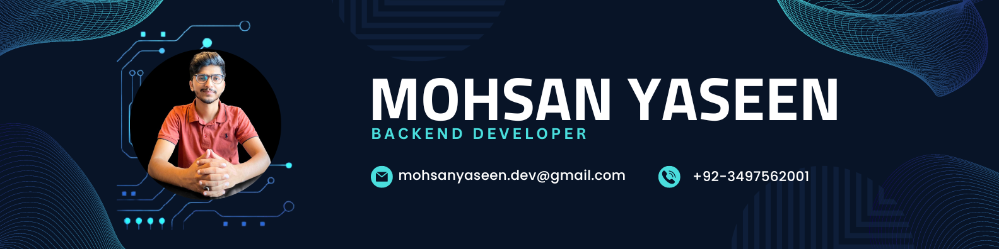

# MOHSAN YASEEN - Python/Backend Developer

## About Me

I am a passionate Software Engineer with experience in Python and Backend Development. I love solving complex problems and contribuzting to innovative solutions. My expertise extends to NLP, ML, and Computer Vision technologies.

- 📧 Email: mohsanyaseen.dev@gmail.com
- 💼 LinkedIn: [LinkedIn Profile](https://www.linkedin.com/in/mohsan-yaseen)
- 🐙 GitHub: [GitHub Profile](https://github.com/Mohsan57)

## Technical Skills

- Python (FastAPI, Django)
- Java (Swing, JavaFX)
- Rest APIs
- NLP/ ML / Computer Vision
- Database Design (Oracle)
- Git

## Projects

### 1. FYP (Surveillance System)

Developed a cutting-edge web application utilizing deep learning and computer vision technologies to enable real-time tracking and re-identification of individuals in videos and live camera feeds. Deployed on Google Cloud Compute Engine. Utilized Python, GCP, HTML, CSS, and JavaScript to create an immersive user experience and facilitate seamless surveillance operations.

- 🌐 **API Link**: [Campus Surveillance System](http://ipfypcms.ddns.net)

### 2. Website Development (www.dealbnao.com)

Collaborated with a friend to develop the client website 'www.dealbnao.com' using WordPress. Customized the backend of the theme and classified the listing plugin to meet specific requirements. Implemented user account customization for 'customer', 'agent', and 'company' roles. Created a targeted listing feature for agents and companies, improving credibility and quality. Resulted in a fully functional and tailored website for real estate transactions.

## Education

- 🎓 BS Software Engineering, The University of Lahore (UOL), Sep-19 to Jul-23, CGPA: 3.05
- 🎓 Intermediate in Computer Science, Punjab Group of Colleges Gujranwala (PGC), Jul-17 to May-19

## Achievements

- 🏆 AIEF 1st National AI Championship (Jul-2023):
  - Selected as one of the top 30 AI projects out of 200 at the AI Championship organized by LUMS University, FAST University, Soliton Technologies, and the Artificial Intelligence Education Foundation.
  - Awarded a certificate for outstanding participation and performance in the competition.

## Contact

- 📞 Phone 1: +92 349-7562001
- 📞 Phone 2: +92 344-5162050

## Download CV(Mohsan Yaseen.pdf) 
